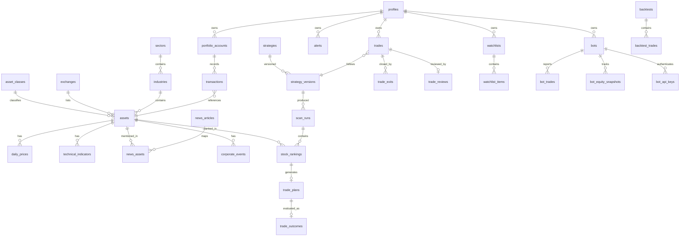

# TradeOS — Personal Investment & Trading Intelligence Platform

Architecture proposal, database design, API design, provider architecture,
security architecture, free-tier deployment plan, and implementation roadmap.

> Product rule zero: DATA → ANALYSIS → SETUP → TRADE PLAN → **USER DECISION**
> → TRADE → RESULT → ANALYSIS. No automatic execution. Every score is
> explainable and every threshold configurable. NO TRADE is a valid answer.

---

## 1. Repository context (inspected before design)

The repo already contains **swingscan** — a working Python Indian swing-trade
selection engine (NIFTY 500 scanner, market regime, sector/relative strength,
pullback/breakout setups, risk plans, backtesting, walk-forward, 52 unit
tests, strict no-lookahead guarantees). **Nothing is deleted or replaced.**

Decision: swingscan stays the quantitative brain. The platform wraps it:
GitHub Actions run it daily; its scan output is written into Supabase
(`scan_runs`, `stock_rankings`, `trade_plans`); web/mobile render those rows.
This honors "one shared business-logic layer" for analytics — the scanner
logic exists once, in Python, already tested. TypeScript owns portfolio /
journal / UI math in `packages/calculations` (also tested once, shared by
web + mobile + API).

## 2. Architecture

```
   Web (Next.js, Vercel) ─────┐
                              ├── Next.js Route Handlers (/api/*)  ← one API
   Mobile (Expo RN) ──────────┘        │ zod-validated, rate-limited
                                       ▼
                        Supabase (Postgres + Auth + RLS + Storage)
                                       ▲
   GitHub Actions (cron) ──────────────┤
     market-data-update                │ writes via service role
     indicator-update / sector-ranking │ (never shipped to clients)
     stock-scan  (runs swingscan)      │
     news-update / event-update        │
     signal-evaluation / alerts        │
                                       ▼
   Provider layer (packages/market-data, packages/news)
     MarketDataProvider | NewsProvider | FundamentalDataProvider
     CorporateEventsProvider | CryptoProvider | GoldProvider
```

One backend (Next.js route handlers + Supabase), one database (Supabase
Postgres), one shared business-logic layer (`packages/*` for TS,
`swingscan/` for quant analytics). Mobile and web hit the same API and the
same Supabase project. No second database, ever.

### Technology choices (and why)

| Layer | Choice | Why |
|---|---|---|
| Web | Next.js 15 (App Router) + TypeScript + React 19 | Vercel free tier, server components for data-heavy pages, route handlers as the single API |
| Mobile | Expo (React Native) + expo-router + TypeScript | Free builds via EAS free tier, shared TS types/calculations, real native push later |
| DB/Auth | Supabase Postgres + Supabase Auth + RLS | Free tier: 500MB DB, auth, storage; RLS gives per-user isolation at the database, not the app |
| Styling | Tailwind CSS v4, custom dark terminal theme | Dense financial UI without a heavyweight component framework |
| Charts | `lightweight-charts` (TradingView OSS) for price; small SVG sparklines for the rest | Professional financial charting, free, tiny |
| Validation | zod (shared schemas in `packages/types`) | One schema = runtime validation + static types on both apps |
| State | React Query (server cache) + Zustand only where client state is real | Explicitly avoids over-engineering |
| Decimal math | decimal.js in `packages/calculations` | Rule 88: no float money math |
| Scheduled jobs | GitHub Actions cron | Free 2,000 min/month; daily cadence fits easily |
| Quant engine | existing Python swingscan via `uv` in Actions | Already built + tested; don't rewrite in TS for ideology |
| Tests | vitest (TS), pytest (swingscan), Playwright (E2E, later phase) | |

## 3. Database ER diagram (core)



Full table list (section 77 of the brief) is implemented across phased
migrations; Phase 1 ships the foundation subset (see §5).

## 4. Schema principles

- Transactions are the source of truth; holdings are **derived** (SQL view /
  computed on read), never hand-edited (brief §11).
- Every strategy row is immutable once referenced: changes create a new
  `strategy_versions` row; scans and trades store the version id (brief §17).
- `scan_runs`/`stock_rankings` are append-only — no overwrites (brief §57).
- Enum types for trade lifecycle (`PLANNED…INVALIDATED`), transaction types,
  regimes, alert types, data freshness (`LIVE/RECENT/STALE/DEMO/UNAVAILABLE`).
- `numeric(20,6)` for money/quantity columns — no floats in the database.
- Soft delete (`deleted_at`) only where user data benefits (notes, watchlists).
- Every table: `created_at`, `updated_at` (trigger), FK + unique constraints,
  indexes on all FK columns and query paths (symbol, date, user_id).

## 5. Phased migrations

| Migration | Phase | Contents |
|---|---|---|
| `0001_foundation` | 1 | profiles+roles (+signup trigger), asset_classes, exchanges, sectors, industries, assets, currencies; RLS everywhere |
| `0002_portfolio` | 2 | portfolio_accounts, transactions (+holdings view), fx_rates |
| `0003_trading` | 3 | strategies, strategy_versions, trades, trade_exits, trade_reviews, trade_notes |
| `0004_market_data` | 4 | daily_prices, technical_indicators, market_indices, data_provider_status |
| `0005_intelligence` | 5 | market_regime_history, market_breadth, sector_prices, sector_rankings, scan_runs, stock_rankings, trade_plans |
| `0006_news_events` | 6 | news_articles, news_assets, corporate_events, earnings_events |
| `0007_bots_alerts` | 8–9 | bots, bot_api_keys, bot_trades, bot_equity_snapshots, bot_events, alerts, notifications |
| `0008_research` | 10–11 | trade_outcomes (signal evaluation), backtests, backtest_trades, system_logs |

## 6. API design

All under `apps/web/app/api/*` (route handlers = the one backend). Every
route: zod input validation, Supabase session auth (user routes) or
`x-api-key` + HMAC signature (bot routes) or `CRON_SECRET` bearer (jobs).

```
GET  /api/health                      system health (db, providers, cron ages)
GET  /api/portfolio                   holdings + P&L (derived from ledger)
POST /api/transactions                add BUY/SELL/DEPOSIT/…
GET  /api/trades      POST /api/trades           journal
POST /api/trades/:id/exit             close/partial-close
POST /api/trades/:id/review           behavioral review answers
GET  /api/markets/overview            NIFTY/BANKNIFTY/VIX/BTC/GOLD/SPX/NDX
GET  /api/screener/latest             latest scan_run + rankings + plans
GET  /api/screener/history?symbol=    historical signals for a stock
GET  /api/stocks/:symbol              research page payload
GET  /api/stocks/:symbol/why-moving   movement attribution (labeled analysis)
GET  /api/news?category=&symbol=      news feed
GET  /api/events?window=              corporate events / earnings
CRUD /api/watchlists, /api/alerts
POST /api/bots/trades|heartbeat|equity   bot ingestion (key+signature+rate limit)
POST /api/jobs/{market-data|scan|news|…} cron-only, CRON_SECRET protected
```

## 7. Provider architecture (mandatory abstraction)

`packages/market-data/src/providers/types.ts` defines the interfaces; concrete
adapters register in a factory keyed by env config. Nothing outside the
package imports a concrete provider.

```ts
interface MarketDataProvider {
  id: string;
  getDailyBars(symbol: string, range: DateRange): Promise<OHLCVBar[]>;
  getQuote(symbol: string): Promise<Quote>;          // delayed OK, flagged
  getFreshness(): DataFreshness;                     // LIVE|RECENT|STALE|…
}
interface NewsProvider { getLatestNews(): Promise<NewsArticle[]>;
                         getNewsForSymbol(s: string): Promise<NewsArticle[]>; }
// FundamentalDataProvider, CorporateEventsProvider, CryptoProvider, GoldProvider — same pattern
```

Initial free adapters (all official/free-tier, no ToS-violating scraping):
Yahoo Finance daily bars for NSE tickers + indices (already proven by
swingscan, incl. the discovered stale-^CNX*-sector-index issue — sector
series are computed from constituents instead); NSE archives CSV for the
universe; CoinGecko free API (BTC/crypto); gold via Yahoo (GC=F / XAUUSD=X);
RSS feeds (official) for news in Phase 6; AlphaVantage/Finnhub free keys as
optional fundamentals adapters. Every response is cached in Postgres and
stamped with provider + freshness; UI must render the freshness badge.

## 8. Security architecture

- Supabase Auth (email/password + magic link); JWT in httpOnly cookies via
  `@supabase/ssr` on web; SecureStore on mobile.
- **RLS on every user table**: `user_id = auth.uid()`; admin policies via a
  `is_admin()` security-definer function checking `profiles.role`.
- Service-role key exists ONLY in GitHub Actions secrets and Vercel
  server-side env; never in `NEXT_PUBLIC_*`, never in the mobile bundle.
- Bot API: per-bot API key (hashed at rest) + HMAC-SHA256 signature over the
  raw body + timestamp window + per-key rate limiting; keys revocable.
- Cron endpoints require `Authorization: Bearer ${CRON_SECRET}`.
- All inputs zod-validated at the route boundary; all money math server-side.
- Exports (CSV/JSON) generated per authenticated user only.

## 9. Free-tier deployment plan

| Component | Service | Free-tier fit |
|---|---|---|
| Web + API | Vercel Hobby | Personal scale ≪ limits; route handlers stay under 10s (heavy work lives in Actions) |
| DB/Auth | Supabase Free | 500MB: daily bars for ~500 symbols × 10y ≈ 1.3M rows ≈ 150–200MB with indexes — fits; prune indicators (recompute > store, brief §93) |
| Mobile | Expo EAS Free | Dev builds + OTA updates |
| Cron | GitHub Actions | Daily jobs ≈ 15–30 min/day ≪ 2,000 min/month |
| Charts/libs | OSS | lightweight-charts, decimal.js, zod |

Upgrade path documented per component; provider abstraction means paid data
(e.g. a licensed NSE feed) is an adapter, not a rewrite.

## 10. Roadmap = brief §95 phases 1–12

Phase gates: `npm run typecheck && npm run lint && npm run test && npm run
build` + migration validation must pass before the next phase starts.

## 11. Risks & limitations (stated up front)

1. **Free market data is delayed/unofficial.** Yahoo NSE data is fine for
   EOD swing analytics (proven by swingscan) but is not exchange-grade and
   must never be labeled LIVE. Freshness badges are mandatory, not cosmetic.
2. **Survivorship bias** in historical universes (current NIFTY 500 list);
   already documented in swingscan reports; point-in-time membership is the fix.
3. **Supabase 500MB ceiling** — managed by retention rules (brief §93):
   keep personal records + scan history forever, recompute indicators.
4. **GitHub Actions cron jitter** (±minutes) — acceptable for EOD cadence.
5. **News sentiment on free tier** is heuristic/LLM-assisted and must stay
   an *input*, never an auto-signal (brief §35–36).
6. **Expo push** needs a real device + Expo project setup (Phase 9).
7. **No broker integration** initially by design; execution remains manual.
```
